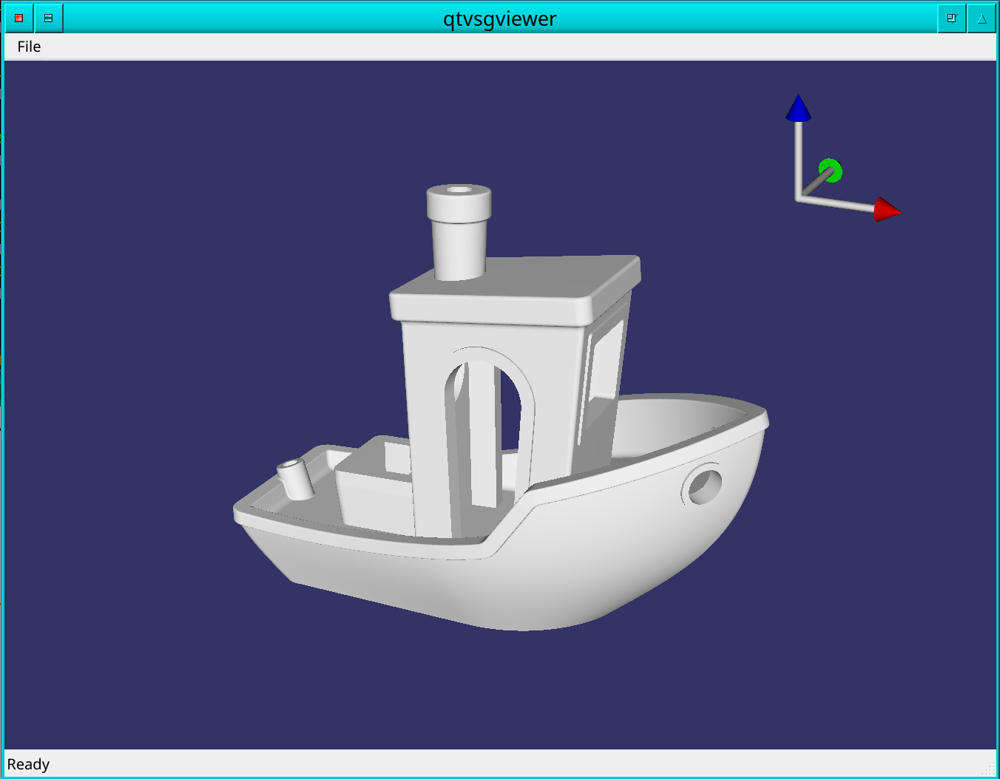

# Intro

A user friendly 3d model viewer based on qt and Vulkan Scene Graph. It is also used as a test bed for me learning VSG.

# Screenshot

# License

This code is currently licensed under GPL v3. See COPYING for details

# Author

Dov Grobgeld <dov.grobgeld@gmail.com>

